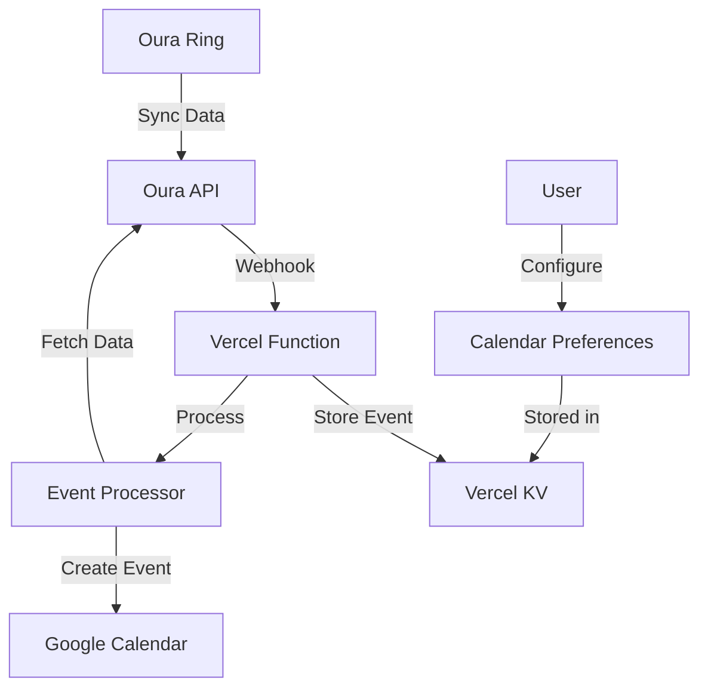

# 🏃‍♂️ Oura Calendar Sync

Automatically sync your Oura Ring health data (sleep, workouts, and sessions) to Google Calendar in real-time using webhooks.


## ✨ Features

- 🔄 **Real-time Sync**: Webhook-based automatic syncing when new Oura data is available
- 📅 **Smart Calendar Integration**: Choose different calendars for sleep, workouts, and sessions
- 💤 **Sleep Tracking**: Detailed sleep events with scores, stages, and heart rate data
- 🏃‍♂️ **Workout Events**: Exercise tracking with duration, calories, and heart rate
- 🧘‍♂️ **Session Events**: Meditation and breathing sessions with calculated statistics
- 🔐 **Secure Authentication**: Direct OAuth with Google and Oura (no Firebase required)
- 🔄 **Token Management**: Automatic refresh of expired access tokens
- 🎨 **Modern UI**: Clean, responsive interface with real-time connection status

## 🏗️ Architecture

- **Frontend**: Vanilla HTML/CSS/JavaScript hosted on Vercel
- **Backend**: Vercel Serverless Functions
- **Database**: Vercel KV (Redis) for token storage
- **APIs**: Google Calendar API, Oura Ring API v2
- **Webhooks**: Real-time event processing with 5-day TTL

## 🚀 Quick Start

### 1. Prerequisites

- [Vercel Account](https://vercel.com) (free tier works)
- [Google Cloud Console](https://console.cloud.google.com) project
- [Oura Developer Account](https://cloud.ouraring.com/oauth/applications)

### 2. Google Cloud Setup

1. **Create a Google Cloud Project**
2. **Enable Google Calendar API**:

   - Go to APIs & Services → Library
   - Search "Google Calendar API" → Enable

3. **Create OAuth Credentials**:

   - APIs & Services → Credentials
   - Create Credentials → OAuth 2.0 Client IDs
   - Application type: Web application
   - Authorized redirect URIs: `https://your-app.vercel.app`

4. **Note your credentials**:
   - Client ID: `123456789-abc.apps.googleusercontent.com`
   - Client Secret: `GOCSPX-xyz123abc` (keep secret!)

### 3. Oura Developer Setup

1. **Create an Oura App**:

   - Go to [Oura Developer Portal](https://cloud.ouraring.com/oauth/applications)
   - Create new application
   - Set redirect URI: `https://your-app.vercel.app/api/oura-callback`

2. **Note your credentials**:
   - Client ID: `YOUR_OURA_CLIENT_ID`
   - Client Secret: `YOUR_OURA_CLIENT_SECRET`

### 4. Deploy to Vercel

1. **Clone and deploy**:

   ```bash
   git clone <your-repo>
   cd frontend
   vercel --prod
   ```

2. **Set environment variables** in Vercel Dashboard:

   ```
   GOOGLE_CLIENT_SECRET=GOCSPX-xyz123abc
   OURA_CLIENT_SECRET=YOUR_OURA_CLIENT_SECRET
   OURA_WEBHOOK_VERIFICATION_TOKEN=<generate-random-string>
   ```

3. **Add Vercel KV database**:
   - Vercel Dashboard → Storage → Create Database → KV

### 5. Update App Configuration

1. **Update frontend configuration** in `public/index.html`:

   ```javascript
   const GOOGLE_CLIENT_ID = "your-actual-google-client-id";
   const API_BASE_URL = "https://your-app.vercel.app/api";
   ```

2. **Update redirect URIs**:
   - Google Cloud Console: Add `https://your-app.vercel.app`
   - Oura Developer Portal: Add `https://your-app.vercel.app/api/oura-callback`

### 6. Set Up Webhooks

1. **Generate verification token**:

   ```bash
   openssl rand -base64 32
   ```

2. **Add to Vercel environment**:

   ```
   OURA_WEBHOOK_VERIFICATION_TOKEN=<your-generated-token>
   ```

3. **Subscribe to webhooks** (one-time setup):
   ```bash
   curl -X POST https://your-app.vercel.app/api/subscribe-oura-webhooks
   ```

## 📖 Usage

### Connecting Your Accounts

1. **Visit your deployed app**: `https://your-app.vercel.app`
2. **Sign in with Google** to authorize calendar access
3. **Connect Oura Ring** to authorize health data access
4. **Configure calendar preferences** for each data type

### Calendar Events

The app creates three types of calendar events:

#### 💤 Sleep Events

- **Title**: `💤 Sleep: 7h 45m`
- **Details**: Sleep score, stages (deep, REM, light), heart rate, HRV
- **Time**: Bedtime start to bedtime end
- **Color**: Blue, marked as "transparent" (doesn't show as busy)

#### 🏃‍♂️ Workout Events

- **Title**: `🏃‍♂️ Running: 45m`
- **Details**: Duration, distance, calories, heart rate (avg/max)
- **Time**: Workout start to end time
- **Color**: Green

#### 🧘‍♂️ Session Events

- **Title**: `🧘‍♂️ Meditation: 15m (54.8 bpm avg)`
- **Details**: Calculated heart rate and HRV statistics from raw data
- **Time**: Session start to end time
- **Color**: Purple

### Calendar Preferences

Choose different calendars for each event type:

- **Sleep**: Personal calendar, work calendar, or health calendar
- **Workouts**: Fitness calendar or main calendar
- **Sessions**: Wellness calendar or main calendar

## 🔧 API Endpoints

| Endpoint                       | Method   | Description                             |
| ------------------------------ | -------- | --------------------------------------- |
| `/api/google-auth`             | POST     | Google OAuth token exchange             |
| `/api/oura-callback`           | GET      | Oura OAuth callback handler             |
| `/api/oura-webhook`            | GET/POST | Webhook verification and event receiver |
| `/api/process-webhook-event`   | POST     | Process queued webhook events           |
| `/api/subscribe-oura-webhooks` | POST     | Set up webhook subscriptions            |
| `/api/update-calendar-prefs`   | GET/POST | Manage calendar preferences             |
| `/api/get-oura-status`         | GET      | Check Oura connection status            |
| `/api/refresh-google-token`    | POST     | Refresh expired Google tokens           |
| `/api/user-mapping`            | GET/POST | Debug user ID mappings                  |

## 🔐 Environment Variables

| Variable                          | Description                | Required |
| --------------------------------- | -------------------------- | -------- |
| `GOOGLE_CLIENT_SECRET`            | Google OAuth client secret | Yes      |
| `OURA_CLIENT_SECRET`              | Oura OAuth client secret   | Yes      |
| `OURA_WEBHOOK_VERIFICATION_TOKEN` | Webhook verification token | Yes      |
| `WEBHOOK_CLEANUP_SECRET`          | Cleanup job authorization  | Optional |

## 🛠️ Development

### Local Development

1. **Install Vercel CLI**:

   ```bash
   npm i -g vercel
   ```

2. **Run development server**:

   ```bash
   vercel dev
   ```

3. **Set up local environment**:
   ```bash
   vercel env pull .env.local
   ```

### Testing Webhooks

Test webhook functionality:

```bash
# Check user mapping
curl "https://your-app.vercel.app/api/user-mapping?googleUserId=12345"

# Manual event processing
curl -X POST https://your-app.vercel.app/api/process-webhook-event \
  -H "Content-Type: application/json" \
  -d '{"eventKey": "webhook_event:user123:1234567890"}'
```

## 🔍 Troubleshooting

### Common Issues

**"redirect_uri_mismatch"**

- Ensure redirect URIs in Google Cloud Console match your Vercel URL exactly

**"Oura authentication failed"**

- Verify `OURA_CLIENT_SECRET` environment variable
- Check Oura app redirect URI matches your backend endpoint

**"No refresh token available"**

- Users need to re-authenticate due to `prompt=consent` requirement
- Clear browser localStorage and reconnect accounts

**Webhook events not processing**

- Check Vercel function logs for errors
- Verify webhook verification token matches
- Ensure user mapping exists between Oura and Google user IDs

### Debug Tools

1. **Check user mapping**:

   ```
   GET /api/user-mapping?googleUserId={id}
   GET /api/user-mapping?ouraUserId={id}
   ```

2. **View Vercel logs**:

   - Vercel Dashboard → Functions → View Logs

3. **Test token refresh**:
   ```bash
   curl -X POST https://your-app.vercel.app/api/refresh-google-token \
     -H "Content-Type: application/json" \
     -d '{"userId": "google-user-id"}'
   ```

## 📊 Data Flow



## 💰 Cost Breakdown (Free Tier)

- **Vercel**: Free (100GB bandwidth, 100K function invocations)
- **Vercel KV**: Free (30K operations/month)
- **Google Calendar API**: Free
- **Oura API**: Free (personal use)

**Total: $0/month** for personal projects! 🎉

## 📝 License

MIT License - see [LICENSE](LICENSE) file for details.

## 🤝 Contributing

1. Fork the repository
2. Create a feature branch
3. Make your changes
4. Add tests if applicable
5. Submit a pull request

## 🙏 Acknowledgments

- [Oura Ring](https://ouraring.com) for the health data API
- [Google Calendar](https://calendar.google.com) for calendar integration
- [Vercel](https://vercel.com) for hosting and serverless functions

## 📞 Support

- **Issues**: Create a GitHub issue
- **Questions**: Check existing issues or start a discussion
- **Documentation**: Refer to API documentation links above

---

Made with ❤️ for the health-conscious developer community
